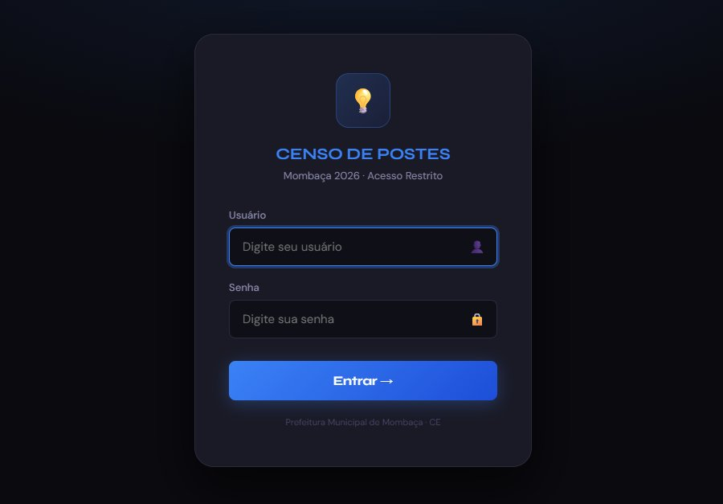
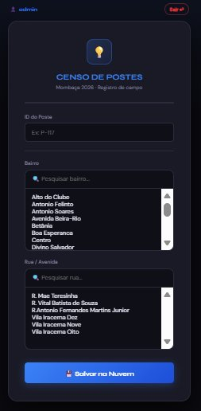

# 📊 Web-Censo — Postes de Mombaça 2026

> Sistema web containerizado para digitalizar o censo de infraestrutura urbana do município de Mombaça/CE, substituindo planilhas manuais por uma solução segura, responsiva e hospedada na nuvem.

[](https://python.org)
[](https://flask.palletsprojects.com)
[](https://docker.com)
[](https://aws.amazon.com/s3)
[](LICENSE)

---

## 🗂️ Índice

- [Sobre o Projeto](#-sobre-o-projeto)
- [Fluxo Completo do Usuário](#-fluxo-completo-do-usuário)
- [Interface do Sistema](#-interface-do-sistema)
- [Tecnologias Utilizadas](#️-tecnologias-utilizadas)
- [Segurança](#-segurança)
- [Validação de Dados](#-validação-de-dados)
- [Documentação da API](#-documentação-da-api)
- [Pré-requisitos](#-pré-requisitos)
- [Como Executar](#-como-executar)
- [Variáveis de Ambiente](#-variáveis-de-ambiente)
- [Estrutura do Projeto](#-estrutura-do-projeto)
- [Autor](#-autor)

---

## 📌 Sobre o Projeto

O **Web-Censo** é uma aplicação Full Stack desenvolvida como projeto prático da **Unidade 5 — Provimento de Serviços Computacionais** do programa **Capacita-iRede** (Nuvem e DevOps).

**Problema resolvido:** o município de Mombaça/CE realizava o censo de postes públicos manualmente, em planilhas físicas, sem rastreabilidade e sujeito a perda de dados.

**Solução:** sistema web acessível de qualquer dispositivo (celular, tablet, desktop), com login, cadastro de postes por bairro/rua e backup automático em nuvem a cada registro.

**Funcionalidades:**
- 🔐 Autenticação com controle de sessão e proteção de rotas
- 📋 Cadastro de postes com busca por bairro e rua
- ☁️ Backup automático no Amazon S3 após cada registro
- 📱 Interface 100% responsiva para uso em campo
- 👤 Rastreabilidade: cada registro armazena o operador responsável
- ✅ Validação de dados em múltiplas camadas (frontend + backend)

---

## 🔄 Fluxo Completo do Usuário

```
┌─────────────────────────────────────────────────────────┐
│                   INÍCIO DA SESSÃO                      │
└──────────────────────┬──────────────────────────────────┘
                       │
                       ▼
         ┌─────────────────────────┐
         │   Acessa o sistema      │
         │   http://localhost:5000 │
         └────────────┬────────────┘
                      │
                      ▼
         ┌─────────────────────────┐      ┌──────────────────────┐
         │   Tela de Login         │─────▶│  Credenciais erradas  │
         │  • Usuário              │      │  Mensagem de erro     │
         │  • Senha                │      │  exibida na tela      │
         └────────────┬────────────┘      └──────────────────────┘
                      │ Credenciais corretas
                      ▼
         ┌─────────────────────────┐
         │  Sessão criada no       │
         │  servidor (Flask        │
         │  Session segura)        │
         └────────────┬────────────┘
                      │
                      ▼
         ┌─────────────────────────┐
         │   Formulário de         │
         │   Cadastro              │
         │  • ID do Poste          │
         │  • Bairro (busca)       │
         │  • Rua (busca)          │
         └────────────┬────────────┘
                      │ Clica em "Salvar na Nuvem"
                      ▼
         ┌─────────────────────────┐      ┌──────────────────────┐
         │  Validação Frontend     │─────▶│  Campos vazios?      │
         │  (JavaScript)           │      │  Alerta SweetAlert2  │
         └────────────┬────────────┘      └──────────────────────┘
                      │ Dados válidos
                      ▼
         ┌─────────────────────────┐      ┌──────────────────────┐
         │  Validação Backend      │─────▶│  Dados inválidos?    │
         │  (Flask/Python)         │      │  Retorna HTTP 400    │
         └────────────┬────────────┘      └──────────────────────┘
                      │ Dados válidos
                      ▼
         ┌─────────────────────────┐
         │  Salva no CSV local     │
         │  (com operador + data)  │
         └────────────┬────────────┘
                      │
                      ▼
         ┌─────────────────────────┐      ┌──────────────────────┐
         │  Backup automático      │─────▶│  Falha no S3?        │
         │  Amazon S3              │      │  HTTP 500 + alerta   │
         └────────────┬────────────┘      └──────────────────────┘
                      │ Sucesso
                      ▼
         ┌─────────────────────────┐
         │  ✅ Confirmação na tela  │
         │  Formulário resetado    │
         │  Pronto para novo       │
         │  registro               │
         └─────────────────────────┘
```

---

## 🖥️ Interface do Sistema

### Tela de Login


### Formulário de Cadastro


---

## 🛠️ Tecnologias Utilizadas

| Tecnologia | Versão | Função |
|---|---|---|
| Python / Flask | 3.11+ | Backend, rotas e lógica da aplicação |
| Flask Session | — | Gerenciamento de sessão segura no servidor |
| PostgreSQL | 16 | Banco de dados relacional |
| Docker | 24+ | Containerização da aplicação |
| Docker Compose | 3.8 | Orquestração dos containers |
| Amazon S3 | — | Backup persistente dos dados na nuvem |
| SweetAlert2 | 11 | Alertas e feedback visual no frontend |
| HTML5 / CSS3 | — | Interface responsiva com CSS fluid (`clamp`, `dvh`) |
| JavaScript | ES6+ | Validação frontend e requisições assíncronas |

---

## 🔒 Segurança

Este projeto implementa múltiplas camadas de segurança:

### Autenticação e Sessão
- Sessões gerenciadas pelo **servidor** via `Flask Session` — o cliente não armazena dados sensíveis
- `SECRET_KEY` configurada via variável de ambiente (nunca exposta no código)
- Todas as rotas protegidas por um **decorator personalizado** `@login_requerido` que redireciona para `/login` caso não haja sessão ativa

```python
# Exemplo do decorator de proteção
def login_requerido(f):
    @wraps(f)
    def decorador(*args, **kwargs):
        if 'usuario' not in session:
            return redirect(url_for('main.login'))
        return f(*args, **kwargs)
    return decorador
```

### Proteção de Rotas
| Rota | Proteção |
|---|---|
| `GET /` | 🔒 Sessão obrigatória |
| `POST /salvar` | 🔒 Sessão obrigatória |
| `GET /logout` | 🔒 Sessão obrigatória |
| `GET /login` | 🌐 Pública |
| `POST /login` | 🌐 Pública |

### Infraestrutura
- Banco de dados isolado na **rede privada** do Docker (não exposto externamente)
- Credenciais AWS carregadas exclusivamente via `.env` (nunca versionadas)
- `.gitignore` configurado para excluir `.env` e arquivos sensíveis
- Containers separados por redes: `rede-publica` (app) e `rede-privada` (banco)

### Rastreabilidade
- Cada registro no CSV armazena o **nome do operador** responsável pelo cadastro
- Permite auditoria completa de quem registrou cada poste

---

## ✅ Validação de Dados

O sistema aplica validação em **duas camadas independentes**:

### Camada 1 — Frontend (JavaScript)
Antes de enviar qualquer requisição ao servidor, o JavaScript verifica:

```javascript
function enviar() {
    const id     = document.getElementById('id_poste').value.trim();
    const bairro = document.getElementById('sel_bairro').value;
    const rua    = document.getElementById('sel_rua').value;

    // Bloqueia envio se algum campo estiver vazio
    if (!id || !bairro || !rua) {
        Swal.fire('Atenção!', 'Preencha todos os campos.', 'warning');
        return; // Para aqui — não envia ao servidor
    }
    // ... envia apenas se tudo válido
}
```

### Camada 2 — Backend (Python/Flask)
Mesmo que a validação frontend seja burlada, o backend rejeita dados inválidos:

```python
@app.route('/salvar', methods=['POST'])
@login_requerido
def salvar():
    id_poste = request.form.get('id_poste', '').strip()
    bairro   = request.form.get('bairro',   '').strip()
    rua      = request.form.get('rua',      '').strip()

    # Validação independente no servidor
    if not all([id_poste, bairro, rua]):
        return jsonify({"erro": "Todos os campos são obrigatórios."}), 400
    # ...
```

### Por que duas camadas?
| Situação | Frontend | Backend |
|---|---|---|
| Usuário esquece um campo | ✅ Bloqueia | — |
| Requisição direta via curl/Postman | ❌ Não vê | ✅ Bloqueia |
| JavaScript desativado no browser | ❌ Não executa | ✅ Bloqueia |

---

## 🔌 Documentação da API

**Base URL:** `http://localhost:5000`

---

### `GET /login`
Exibe a tela de login.

**Resposta:** `200 OK` — HTML da página de login

---

### `POST /login`
Autentica o usuário e cria uma sessão.

**Content-Type:** `application/x-www-form-urlencoded`

**Body:**
| Campo | Tipo | Obrigatório | Descrição |
|---|---|---|---|
| `usuario` | string | ✅ | Nome do usuário |
| `senha` | string | ✅ | Senha do usuário |

**Respostas:**
| Status | Descrição |
|---|---|
| `302 Found` | Login bem-sucedido — redireciona para `/` |
| `200 OK` | Credenciais inválidas — retorna login com mensagem de erro |

---

### `GET /`
Exibe o formulário de cadastro de postes.

> 🔒 **Autenticação obrigatória** — redireciona para `/login` se não houver sessão ativa.

**Resposta:** `200 OK` — HTML do formulário

---

### `POST /salvar`
Salva um registro de poste e realiza backup no S3.

> 🔒 **Autenticação obrigatória**

**Content-Type:** `multipart/form-data`

**Body:**
| Campo | Tipo | Obrigatório | Descrição |
|---|---|---|---|
| `id_poste` | string | ✅ | Identificador do poste (ex: `P-117`) |
| `bairro` | string | ✅ | Nome do bairro |
| `rua` | string | ✅ | Nome da rua ou avenida |

**Respostas:**
| Status | Descrição |
|---|---|
| `200 OK` | Registro salvo com sucesso no CSV e no S3 |
| `400 Bad Request` | Campos obrigatórios ausentes — `{"erro": "Todos os campos são obrigatórios."}` |
| `401 Unauthorized` | Sessão expirada ou inexistente |
| `500 Internal Server Error` | Dados salvos localmente, mas falha no backup S3 — `{"erro": "..."}` |

**Exemplo de requisição (curl):**
```bash
curl -X POST http://localhost:5000/salvar \
  -b "session=<cookie>" \
  -F "id_poste=P-117" \
  -F "bairro=Centro" \
  -F "rua=R. Mae Teresinha"
```

---

### `GET /logout`
Encerra a sessão do usuário.

> 🔒 **Autenticação obrigatória**

**Resposta:** `302 Found` — redireciona para `/login`

---

## ✅ Pré-requisitos

- [Docker](https://docs.docker.com/get-docker/) `>= 24`
- [Docker Compose](https://docs.docker.com/compose/install/) `>= 2.0`
- Conta AWS com bucket S3 configurado

---

## 🚀 Como Executar

**1. Clone o repositório**
```bash
git clone https://github.com/LucasRolim-dev/PROJETO-CENSO-POSTES-DE-MOMBACA-2026-WEB
cd PROJETO-CENSO-POSTES-DE-MOMBACA-2026-WEB
```

**2. Configure as variáveis de ambiente**
```bash
cp .env.example .env
# Edite o .env com suas credenciais reais
```

**3. Suba os containers**
```bash
docker-compose up -d
```

**4. Acesse no navegador**
```
http://localhost:5000
```

**Credenciais padrão para teste:**
| Usuário | Senha |
|---|---|
| `admin` | `senha123` |
| `agente1` | `mombaca2026` |

**Para encerrar:**
```bash
docker-compose down
```

**Para ver os logs:**
```bash
docker-compose logs -f web-censo
```

---

## 🔐 Variáveis de Ambiente

Crie um arquivo `.env` na raiz com base no `.env.example`:

```env
# Aplicação
SECRET_KEY=uma-chave-longa-e-aleatoria-aqui

# Banco de dados
DB_HOST=db-censo
DB_USER=censo_user
DB_PASSWORD=sua-senha-aqui
DB_NAME=censo_db

# AWS S3
AWS_ACCESS_KEY_ID=sua-access-key
AWS_SECRET_ACCESS_KEY=sua-secret-key
AWS_REGION=us-east-1
AWS_BUCKET_NAME=nome-do-seu-bucket
```

> ⚠️ **Nunca suba o arquivo `.env` para o repositório.** Ele já está no `.gitignore`.

---

## 📁 Estrutura do Projeto

```
PROJETO-CENSO-POSTES-DE-MOMBACA-2026-WEB/
│
├── app/                        # Pacote principal da aplicação
│   ├── __init__.py             # Factory do Flask (create_app)
│   ├── routes.py               # Todas as rotas (Blueprint)
│   ├── auth.py                 # Login, logout e decorator @login_requerido
│   ├── storage.py              # CSV local e backup AWS S3
│   ├── data.py                 # Listas de bairros e ruas
│   └── templates/
│       ├── login.html          # Tela de login
│       └── index.html          # Formulário de cadastro
│
├── data/
│   └── censo_postes_mombaca_2026.csv   # Dados coletados em campo
│
├── docs/
│   └── demo.mp4                # Vídeo de demonstração
│
├── run.py                      # Ponto de entrada da aplicação
├── Dockerfile                  # Imagem da aplicação
├── docker-compose.yml          # Orquestração dos serviços
├── requirements.txt            # Dependências Python
├── .env.example                # Modelo de variáveis de ambiente
├── .env                        # Variáveis reais (não versionar!)
├── .gitignore                  # Arquivos ignorados pelo Git
├── .dockerignore               # Arquivos ignorados no build Docker
└── README.md                   # Este arquivo
```

---

## 👤 Autor

Desenvolvido por **Lucas Rolim Cavalcante** · [LinkedIn](https://www.linkedin.com/in/lucas-rolim-117-dev/) como projeto prático do programa **Capacita-iRede**.

Município de Mombaça · Ceará · 2026